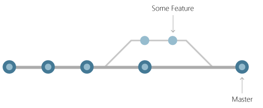

# Инструкция для раблоты с Git и удаленными репозиториями.

## Что такое Git?
Git-это Git — это распределенная система управления версиями, то есть локальный клон проекта — это полный репозиторий управления версиями. Полнофункциональные локальные репозитории упрощают работу как в автономном, так и в удаленном режиме. Разработчики фиксируют свою работу локально, а затем синхронизируют свою копию репозитория с копией на сервере. Эта парадигма отличается от централизованных систем управления версиями, где клиенты должны синхронизировать код с сервером перед созданием новой версии кода.
## Основы Git
При каждом сохранении работы Git создает фиксацию. *Фиксация* — это моментальный снимок всех файлов в определенный момент времени. Если файл не изменился с одной фиксации на следующую, Git использует ранее сохраненный файл. Эта конструкция отличается от других систем, которые хранят начальную версию файла и сохраняют запись изменений с течением времени.
## Ветви
Каждый разработчик сохраняет изменения в собственном локальном репозитории кода. В результате может быть много разных изменений, основанных на одной фиксации. Git предоставляет средства для изоляции изменений и последующего их слияния. Ветви, которые являются упрощенными указателями для выполнения работы, управляют этим разделением. После завершения работы, созданной в ветви, эту ветвь можно снова объединить с основной ветвью команды (или магистралью).
 